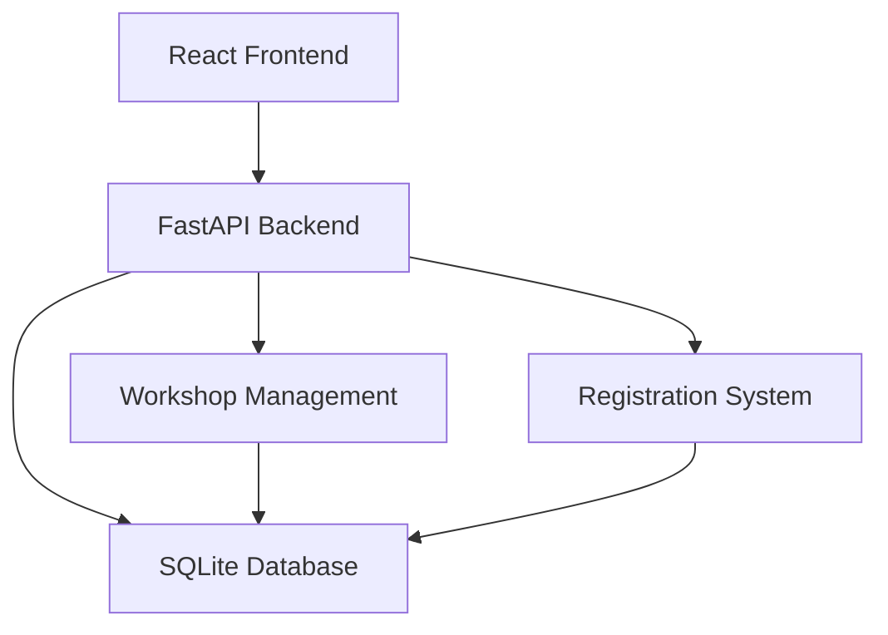

# EE North 10th Anniversary Workshop Showcase

# 1. Project Overview

### Project Name
EE North 10th Anniversary Workshop Showcase

### Brief Description
A clean, single-page showcase of all workshops available at the EE North 10th Anniversary celebration. The application presents workshops in an easy-to-scan format, allowing attendees to quickly browse through all offerings.

### Core Purpose
To provide a clear, comprehensive overview of all workshops available during the EE North 10th Anniversary celebration in a single, easy-to-navigate page.

### Primary Objectives
1. Display all workshops in a clean, organized layout on a single page
2. Make it easy to scan and compare different workshop offerings
3. Provide essential workshop information at a glance
4. Create a simple, intuitive user experience

### Target Audience
- EE North anniversary event attendees
- Workshop facilitators and organizers
- EE North community members

# 2. Key Features & Functionality

### Feature 1: Workshop Grid Layout
- Responsive grid of workshop cards
- Each card displays:
  - Workshop title
  - Facilitator name
  - Time and duration
  - Brief description
  - Location
  - Available spots remaining
- Clean, consistent card design
- Automatic responsive layout for all screen sizes

### Feature 2: Workshop Registration
- One-click registration from workshop cards
- Registration status indicators:
  - Available (with spots remaining)
  - Almost Full (less than 20% spots left)
  - Full (waitlist available)
- Simple cancellation process
- Waitlist management for full workshops

### Feature 3: Workshop Creation
- Simple workshop creation form with:
  - Title and description fields
  - Date and time picker
  - Duration selector
  - Location input
  - Maximum capacity setting
  - Facilitator information
- Form validation with helpful error messages
- Preview capability before submission
- Success confirmation with direct link to created workshop
- Edit capability for workshop creators

# 3. Technical Approach

### Technology Stack
- **Front-end**: React with TypeScript
- **Back-end**: FastAPI (Python)
- **Database**: SQLite (for simplicity in PoC phase)

### High-Level Architecture


### Data Model
1. Workshops
```json
{
  "id": "uuid",
  "title": "string",
  "description": "string",
  "facilitator_name": "string",
  "start_time": "datetime",
  "duration": "integer",
  "location": "string",
  "max_capacity": "integer",
  "current_registrations": "integer",
  "waitlist_enabled": "boolean",
  "created_at": "datetime",
  "modified_at": "datetime",
  "creator_id": "uuid"
}
```

2. Registrations
```json
{
  "id": "uuid",
  "workshop_id": "uuid",
  "timestamp": "datetime",
  "status": "enum(confirmed, waitlisted, cancelled)",
  "confirmation_code": "string"
}
```

### API Endpoints
```
GET /api/workshops - List all workshops
POST /api/workshops - Create new workshop
GET /api/workshops/{id} - Get workshop details
PUT /api/workshops/{id} - Update workshop
DELETE /api/workshops/{id} - Delete workshop

POST /api/workshops/{id}/register - Register for workshop
DELETE /api/workshops/{id}/register - Cancel registration
GET /api/workshops/{id}/registrations - List registrations
```

# 4. Implementation Plan

### Milestones
1. **Project Setup & Basic Structure** (Week 1)
   - Expected Deliverable: Project scaffolding, basic routing, and database setup
   - Set up React and FastAPI projects
   - Configure TypeScript and development environment
   - Create initial database schema
   - Set up basic API structure

2. **Core Workshop Features** (Week 2)
   - Expected Deliverable: Workshop management functionality
   - Implement workshop creation form
   - Build workshop card component
   - Create workshop grid layout
   - Add workshop editing capability

3. **Registration System** (Week 3)
   - Expected Deliverable: Complete registration functionality
   - Implement registration flow
   - Add waitlist functionality
   - Create registration management interface
   - Add email notifications

### Constraints & Dependencies
- Must work well on both desktop and mobile devices
- Should load and render quickly
- Must be accessible and easy to read

# 5. Success Criteria & Measurement

### Goals for Proof of Concept
- All workshops visible and readable on a single page
- Filters working smoothly
- Workshop creation form functioning correctly
- Responsive layout functioning on all common screen sizes
- Clear presentation of workshop information 